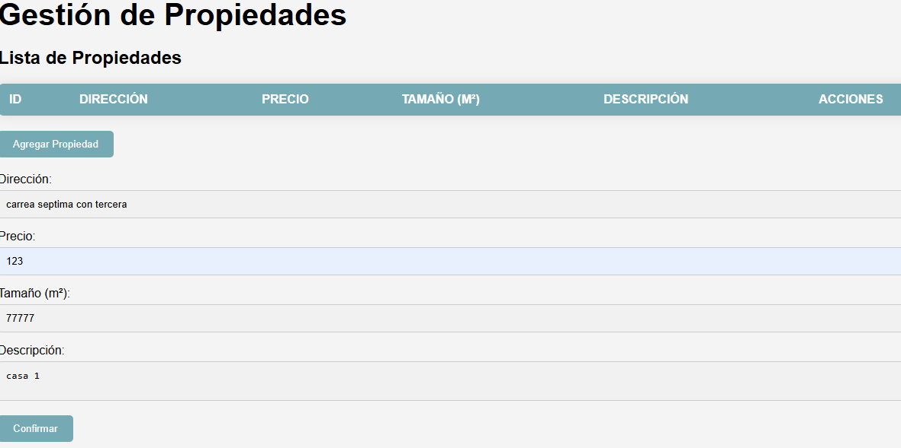
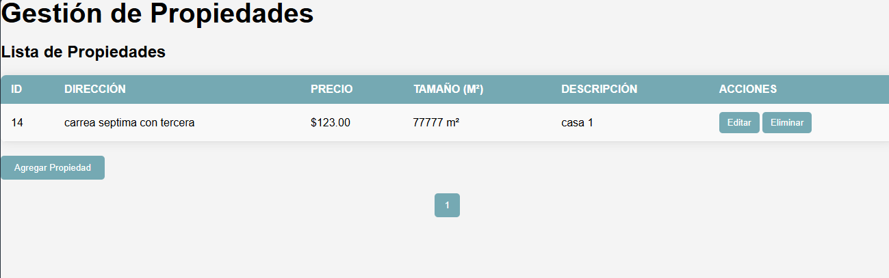
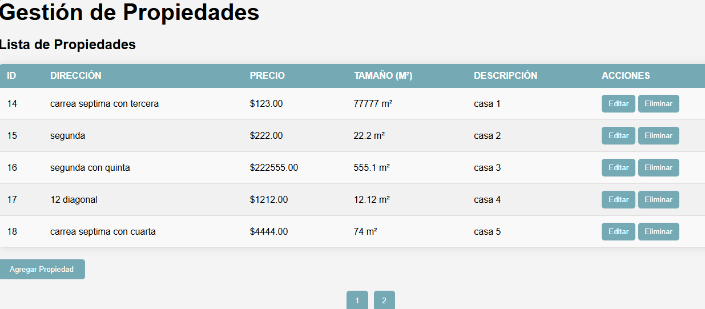
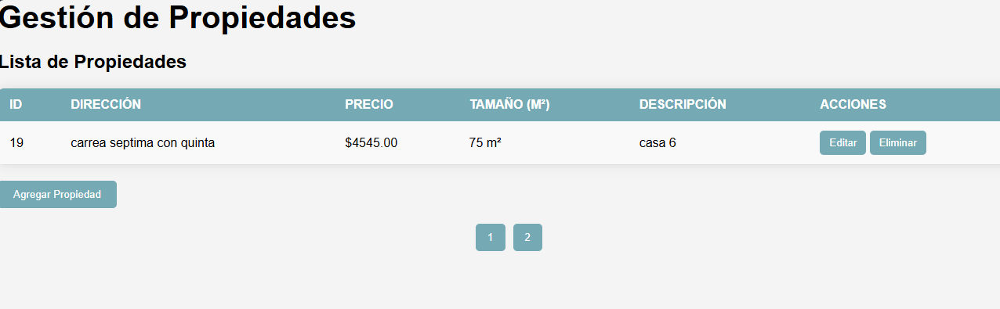
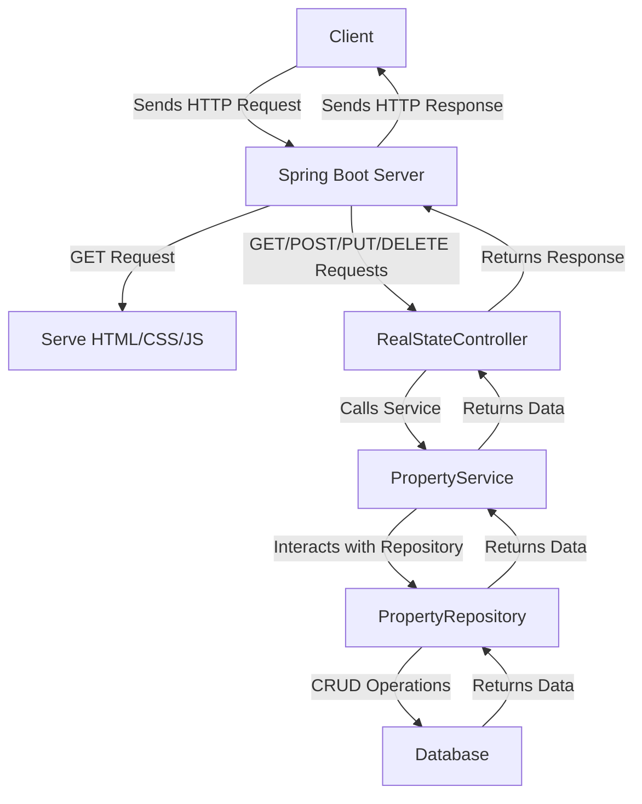
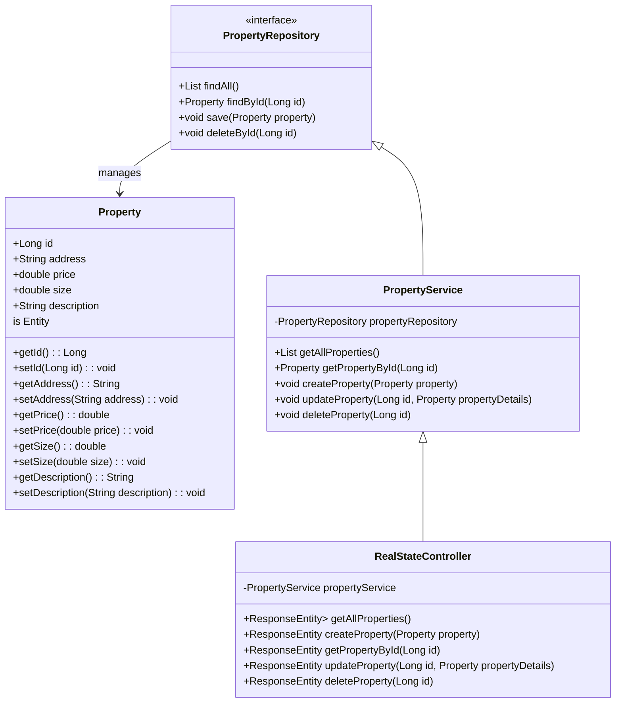
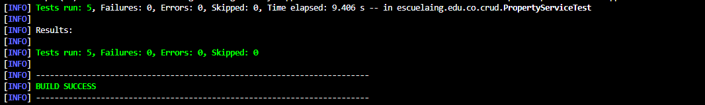

# AREP-LAB05
Autor: David Leonardo Piñeros Cortés

## Taller de Patrones Arquitecturales en la Nube

El objetivo de este taller es desarrollar una aplicación web de administración de propiedades inmobiliarias en Spring-Boot, donde el usuario puede consultar, ingresar, editar y eliminar registros. Adicionalmente se quiere desplegar en AWS con dos instancias, una alojará la base de datos y otra el front y back de la aplicación.

## Instalación y Ejecución
Las siguientes instrucciones son para ejecutar el proyecto LOCALMENTE. El primer paso es instalar git, maven, java y docker en su equipo con las siguientes versiones:

* Apache Maven 3.9.6

* Java 17

* Docker 25.0.3


y luego de esto clonar el repositorio desde la terminal de la siguiente manera:

```
git clone https://github.com/leoncico/AREP-LAB05.git
```

Seguido de esto, se ingresa a la carpeta resultante y se ejecutan los siguientes comandos:
* Para construir y ejecutar la imagen de docker
	```
	docker-compose up -d
	```
* Para compilar el proyecto
	```
	mvn clean install
	```
* Finalmente para ejecutar la aplicación
	```
	mvn spring-boot:run
	```

Luego ingresa desde un Browser a la dirección [localhost:8080]() para interactuar con la aplicación web.

  

Para probar la funcionalidad clickea el botón de Añadir Propiedad e ingresa los campos indicados


También es posible eliminar y editar estos registros y adicionalmente se implementó la paginación para máximo 5 registros por pantalla


Adicionalmente se hizo un despliegue de la aplicación en AWS EC2, donde se tenian dos instancias, una para mysql y otra para la lógica y el front. Es explicado en el siguiente video: 
https://youtu.be/yO09Tetl59k

## Arquitectura
La arquitectura presentada sigue un patrón **MVC (Modelo-Vista-Controlador)** dentro de una aplicación Spring Boot.
* Cliente (Vista): El cliente envía solicitudes HTTP desde una interfaz basada en HTML, CSS y JavaScript. Estas solicitudes pueden ser de tipo GET, POST, PUT o DELETE para gestionar propiedades.
* Controlador (Controller): La clase `RealStateController` es responsable de manejar las solicitudes del cliente. Este controlador recibe los datos de entrada, llama al servicio adecuado y devuelve las respuestas correspondientes (normalmente en formato JSON).
* Servicio (Service): La lógica de negocio reside en el `PropertyService`. Esta capa procesa los datos, maneja las reglas de negocio y delega las operaciones CRUD al repositorio.
* Repositorio (Repository): `PropertyRepository` es la interfaz que conecta la aplicación con la base de datos, realizando las operaciones de creación, lectura, actualización y eliminación (CRUD).
* Base de Datos: El repositorio interactúa con la base de datos para almacenar y recuperar la información de las propiedades.


A continuación el diagrama de clases:


## Test
Para ejecutar las pruebas ejecute el comando:
```
mvn test
```
Se implementaron las siguientes pruebas:
-   **testGetAllProperties()**: Verifica que la lista de propiedades devuelta no esté vacía y contenga la propiedad guardada.
-   **testGetPropertyById()**: Verifica que se pueda recuperar una propiedad por su ID desde la base de datos.
-   **testCreateProperty()**: Verifica que se guarde una nueva propiedad correctamente en la base de datos.
-   **testUpdateProperty()**: Verifica que una propiedad se pueda actualizar correctamente en la base de datos.
-   **testDeleteProperty()**: Verifica que una propiedad se elimine correctamente de la base de datos.



## Build With
- [Spring Boot 3.3.4](https://spring.io/projects/spring-boot) - Framework para el back-end
- [Java](https://www.java.com/) - Lenguaje de programación principal
- [Maven](https://maven.apache.org/) - Gestión de dependencias y automatización de compilación
- [HTML5](https://developer.mozilla.org/es/docs/Web/HTML) - Lenguaje de marcado para la estructura y el contenido
- [CSS3](https://developer.mozilla.org/es/docs/Web/CSS) - Estilos
- [JavaScript](https://developer.mozilla.org/es/docs/Web/JavaScript) - Scripting del lado del cliente
- [MySQL](https://www.mysql.com/) - Base de datos
- [Thymeleaf](https://www.thymeleaf.org/) - Motor de plantillas para Spring Boot (si aplica)
- [Bootstrap](https://getbootstrap.com/) - Framework CSS para diseño responsivo (si aplica)

## Versionado
Version: 1.0

## Autor
David Leonardo Piñeros Cortés

## Licencia
Este proyecto está bajo la Licencia MIT. Ver el archivo [LICENSE](LICENSE) para más detalles.